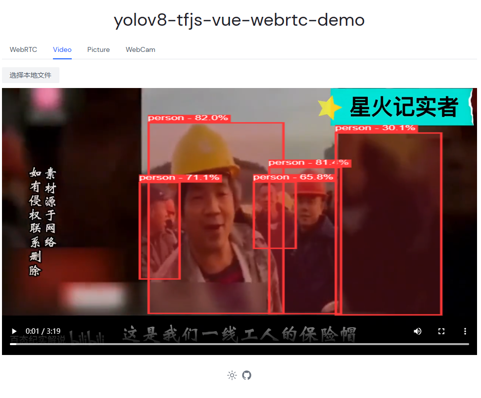

# yolov8-tfjs-vue-webrtc-demo

## Description

"yolov8-tfjs-vue-webrtc-demo"是一个利用深度学习目标检测模型YOLOv8、TensorFlow.js框架、Vue.js框架和WebRTC技术实现的演示项目。该项目可以通过前端界面实时展示视频流，并对视频中的目标进行实时检测和识别。借助GPU加速的WebGL后端，该项目能够实现快速高效的模型推理，同时通过WebRTC技术，还能够实现点对点的视频传输，为实时应用提供了强大的支持。"

"yolov8-tfjs-vue-webrtc-demo" is a demonstration project that utilizes the YOLOv8 deep learning object detection model, the TensorFlow.js framework, the Vue.js framework, and WebRTC technology. This project can display video streams in real-time through a front-end interface, and perform real-time detection and recognition of objects in the video. With the GPU-accelerated WebGL backend, this project can achieve fast and efficient model inference. Additionally, using WebRTC technology, it can enable peer-to-peer video transmission, providing powerful support for real-time applications.

## Demo

link: https://yolov8-tfjs-vue-webrtc-demo.netlify.app/



## how to use 如何使用

将 YOLOv8 转换为 tfjs 模型，并将其放入 public 文件夹中。
打开 [global.ts](src/composables/global.ts) 文件并将以下代码块：
```ts
export const modelName = 'yolov8n'
// replace
export const modelName = 'your model prefix name '
```
编辑 labels.json 文件以匹配您的模型输出标签。

[labels.json](src/utils/labels.json)文件

在终端中运行以下命令：

```bash
pnpm i && pnpm dev
```

## useable models 可用模型

- 安全帽检测 https://huggingface.co/lanseria/yolov8n-hard-hat-detection_web_model

## webRTC 依赖项目请使用 go2RTC 

- go2rtc https://github.com/AlexxIT/go2rtc
